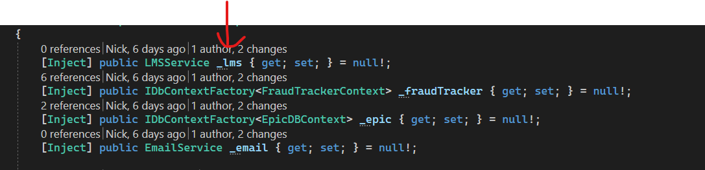

Potential suggestions for warning suppression

- <b>New expression can be simplified</b>
 https://learn.microsoft.com/en-us/dotnet/fundamentals/code-analysis/style-rules/ide0090

- <b>Using statement can be simplified</b>
https://docs.microsoft.com/dotnet/fundamentals/code-analysis/style-rules/ide0063

- <b>Naming rule violation: Prefix '_' not expected</b>
https://learn.microsoft.com/en-us/dotnet/fundamentals/code-analysis/style-rules/naming-rules

- <b>Member does not access instance data and can be made static</b>
https://learn.microsoft.com/en-us/dotnet/fundamentals/code-analysis/quality-rules/ca1822

- <b>Use switch expression</b>
https://learn.microsoft.com/en-us/dotnet/fundamentals/code-analysis/style-rules/ide0066

